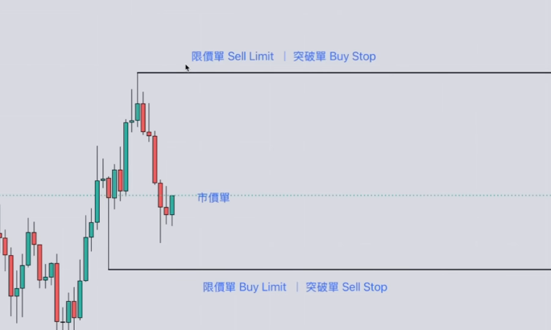
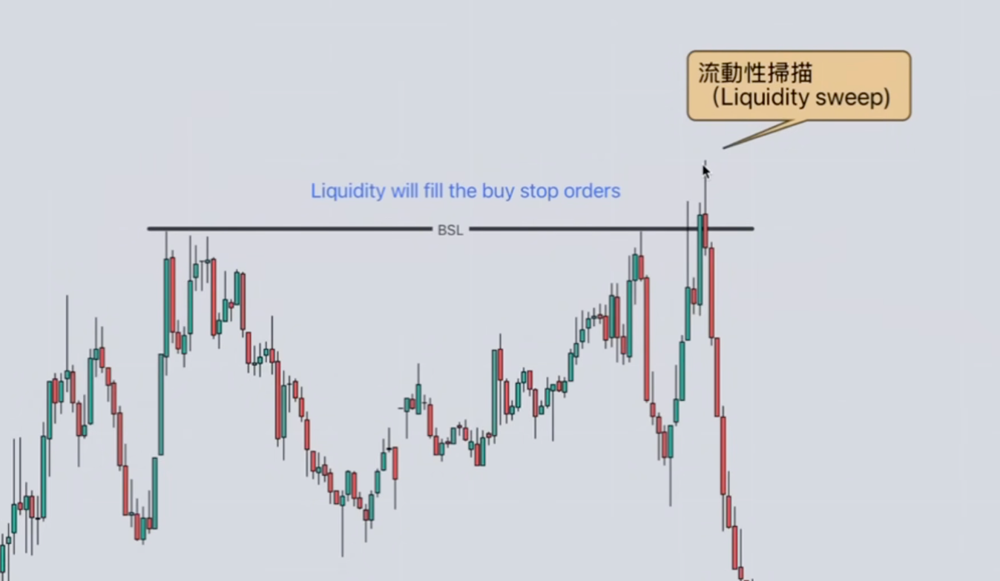
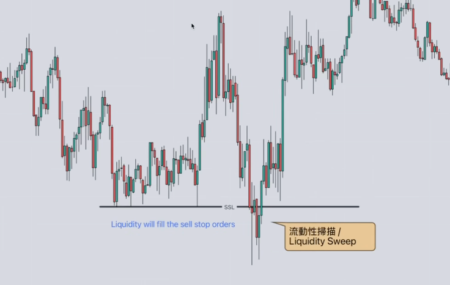
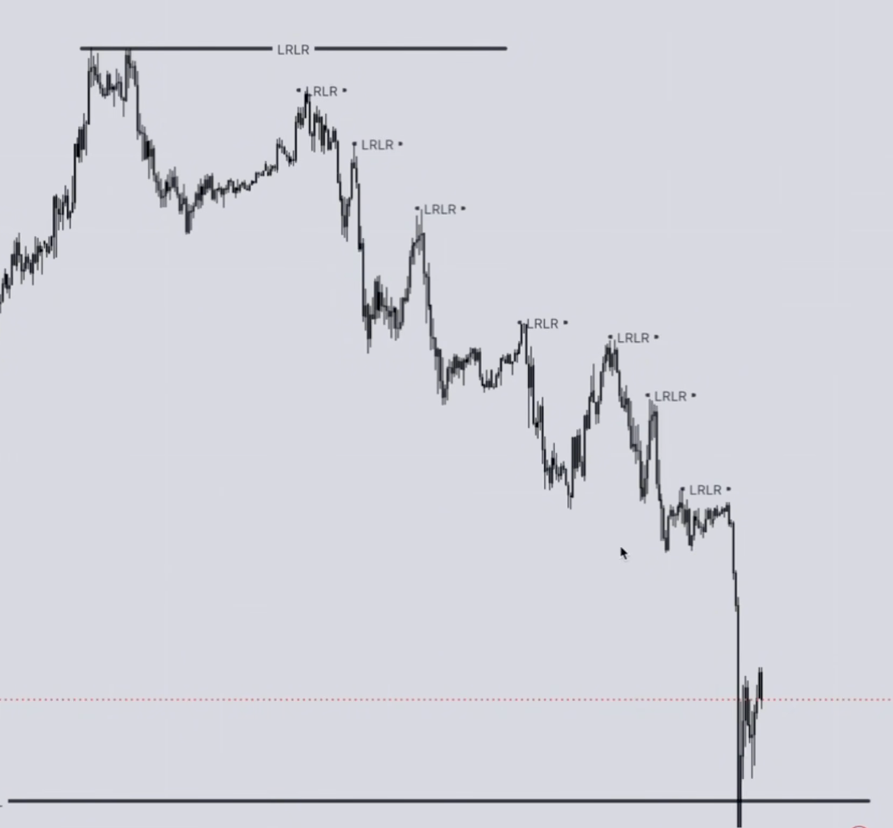
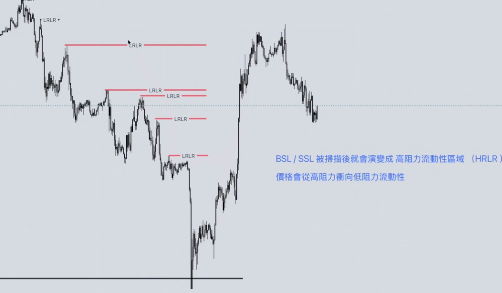

# 机构流动性区（Institutional Liquidity Zones）

## 一、概述

机构流动性区是聪明钱（Smart Money）分析中的核心概念，指市场中订单密集、容易引发价格波动的区域。理解流动性类型与扫描机制，有助于判断价格可能运行的方向与节奏。

---

## 二、流动性类型

| 类型 | 英文 | 说明 |
|------|------|------|
| 上方流动性 | Buy Side Liquidity (BSL) | 多单止损、做多限价单聚集区 |
| 下方流动性 | Sell Side Liquidity (SSL) | 空单止损、做空限价单聚集区 |
| 高点压力流动性 | High Resistance Liquidity | 区间/结构高点附近的流动性 |
| 低点压力流动性 | Low Resistance Liquidity | 区间/结构低点附近的流动性 |
| 区间内流动性 | Internal Range Liquidity | 价格区间内部的流动性 |
| 区间外流动性 | External Range Liquidity | 区间之外的流动性 |
| 流动性池 | Liquidity Pool | 订单集中形成的“池子” |
| 流动性真空 | Liquidity Void | 订单稀少、价格可能快速穿越的区域 |

---

## 三、订单类型与流动性的关系

### 3.1 三类订单

| 订单类型 | 英文 | 常见俗称 | 与流动性的关系 |
|----------|------|----------|----------------|
| 限价单 | Limit Order | 止盈单 | 提供流动性（挂单等待成交） |
| 市价单 | Market Order | — | 直接消耗流动性 |
| 突破单 | Stop Order | 止损单 | **聪明钱进场的“燃料”**——止损被扫后形成流动性释放，推动价格运行 |

### 3.2 核心要点

- **止损单 = 突破单**：被触发后转为市价单，形成流动性扫描（Sweep）。
- **限价单 = 止盈单**：挂在关键价位，构成流动性池。
- 我们的止损单被扫，往往对应聪明钱借流动性进场或出场。

---

## 四、流动性扫描与释放

- **流动性扫描（Liquidity Sweep）**：价格短暂突破某一侧（高或低），扫掉该侧的止损单与限价单，然后回落或反向。
- **流动性释放（Liquidity Run）**：流动性被扫后，订单被执行，资金流动推动价格向另一侧流动性区域运行。

  

---

## 五、高阻力与低阻力流动性

### 5.1 高阻力流动性（HRLR）

- **High Resistance Liquidity Run（HRLR）**：结构/区间高点附近的流动性（BSL/SSL 被扫后演变成高阻力流动性区）。
- 价格从**高阻力流动性**区域向**低阻力流动性**区域运行时，往往形成一波趋势或波段。

### 5.2 低阻力流动性（LRLR）

- **Low Resistance Liquidity Run（LRLR）**：结构/区间低点附近的流动性。
- 与 HRLR 相对，是价格运行的目标区域之一。

### 5.3 价格运行逻辑

1. BSL/SSL 被扫描后，会演变为**高阻力流动性区域（HRLR）**。
2. 价格倾向于从**高阻力流动性**冲向**低阻力流动性**。
3. 理解 HRLR 与 LRLR，有助于预判波段目标与反转区域。

  

---

## 六、小结

- 流动性 = 订单密集区（止损、限价单等）。
- 扫描（Sweep）→ 释放（Run）→ 价格向另一侧流动性运行。
- 结合订单类型（限价/市价/突破单）与高/低阻力流动性（HRLR、LRLR），可更好理解机构行为与价格结构。
