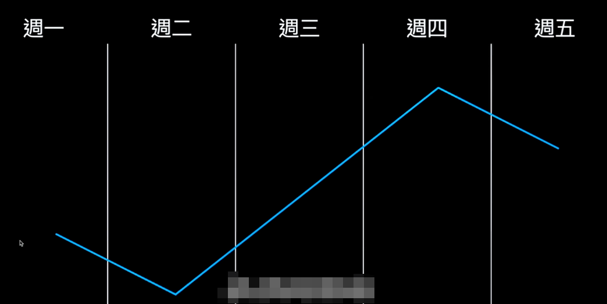
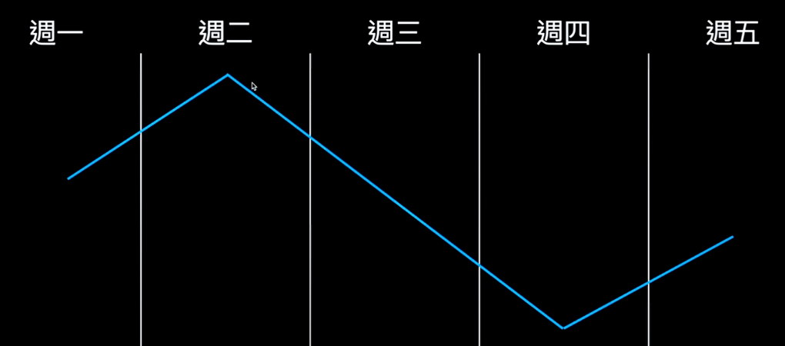
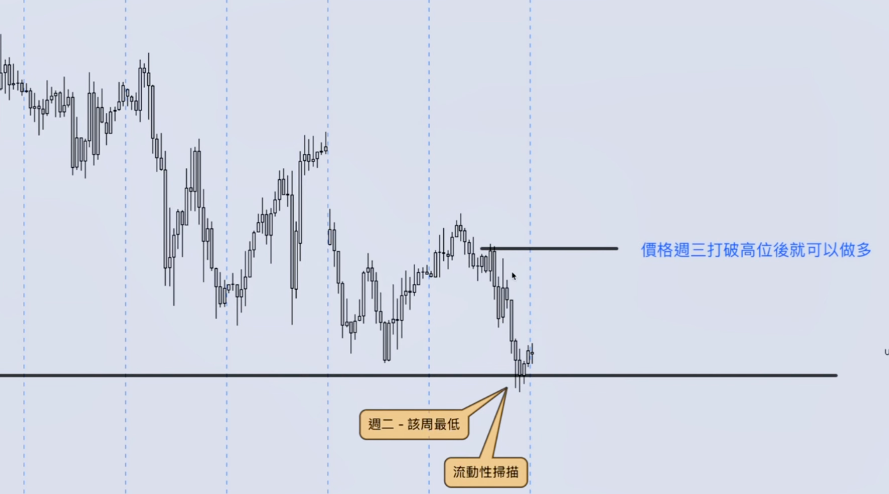
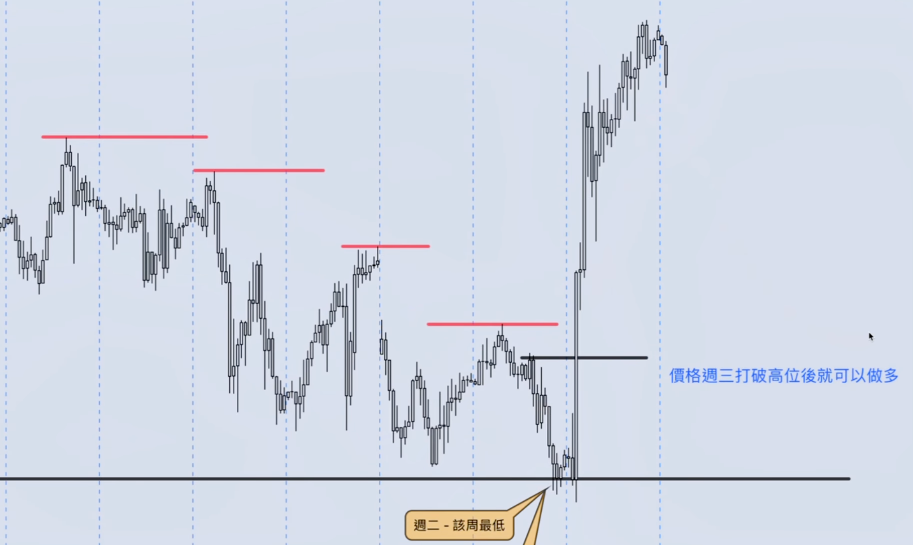
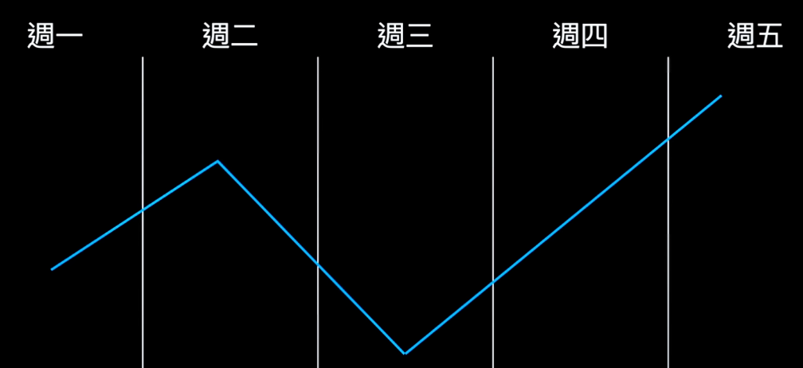
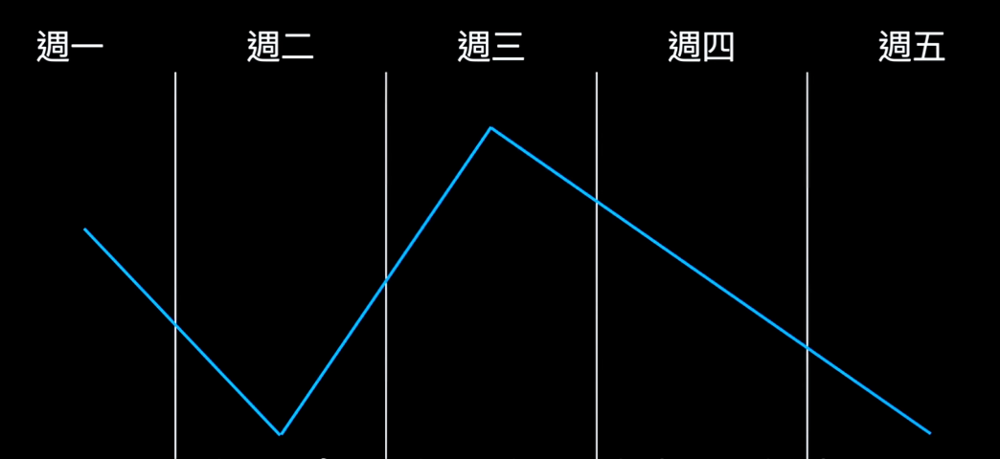
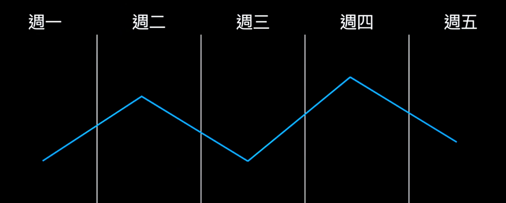

# Weekly Profile（周期形态）

## 一、相关主题（Market Profile）

- Marster ICT Weekly Profiles
- ICT Daily Bias
- ICT Advanced Market Structure
- ICT Market Maker Buy & Sell Model
- ICT Judas Swing
- IRL to ERL
- HRLR to LRLR

---

## 二、Weekly Profile 类型

| 类型 | 英文 |
|------|------|
| 扩张型 | Classic Expansion Profile |
| 周中反转型 | Mid-Week Reversal Profile |
| 震荡后反转型 | Consolidation Reversal Profile |

---

## 三、市场会做什么？

- 创造流动性
- 寻找流动性
- 扫描流动性
- 寻找平衡 / 回到平衡

---

## 四、Classic Expansion（经典扩张型态）

- 周一：动能累计 / 价格往高时框的 PDA
- 周二：创造该周高 / 低点（注意流动性扫描）
- 周二-周四：流动性释放
- 周五：回调，寻找平衡区域

---

## 五、Mid Week Reversal（周中反转型）

- 周一：创高低位
- 周二：动能累计
- 周三：流动性扫描（周一高 / 低位）
- 周三-周五：流动性释放

---

## 六、Consolidation Reversal（震荡后反转型）

- 周一：动能累积 / 创该周高低价
- 周二：动能累积 / 创该周高低价
- 周三：动能累积
- 周四：流动性扫描（周一/周二高低价）
- 周四-周五：流动性释放

---

## 七、小结

- Weekly Profile：创造流动性 → 寻找流动性 → 扫描流动性 → 回到平衡