# PD Array 深入解说

## 目录

- [核心概念](#核心概念)
- [组成元素总览](#组成元素总览)
- [各元素详解](#各元素详解)
  - [订单块](#订单块order-block)
  - [破坏块](#破坏块breaker-block)
  - [公平价差区](#公平价差区fair-value-gap)
  - [平衡价格区间](#平衡价格区间balanced-price-range)
  - [拒绝块](#拒绝块rejection-block)
  - [真空块](#真空块vacuum-block)
  - [补仓块](#补仓块mitigation-block)

---

## 核心概念

**PD Array** = **Premium（高价区）** + **Discounted Zones（低价区）**

| 作用 | 说明 |
|------|------|
| **市场判断** | 帮助判断当前市场属于该买进还是卖出的价格位置 |
| **入场决策** | 回答「现在价格值不值得入场」还是「应该等更好的价格」 |
| **核心理念** | **避开追高杀跌** |

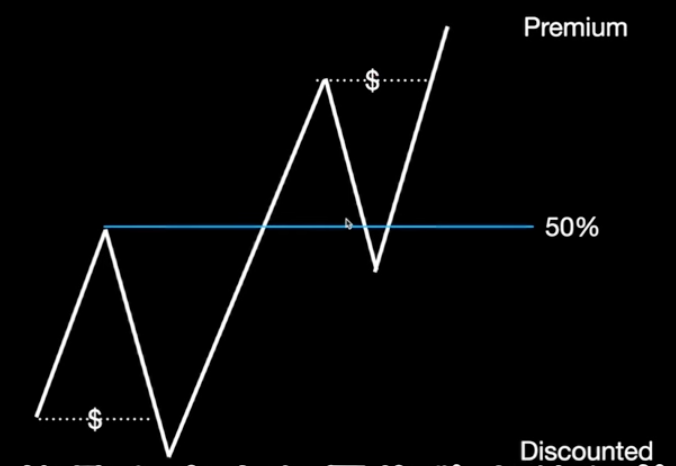

---

## 组成元素总览

PD Array 由以下元素组成，用于判断**合理的交易区**：

| 元素 | 简要说明 |
|------|----------|
| 订单块（Order Block） | 机构出手区域，价格反转/延续起点 |
| 破坏块（Breaker Block） | 被反方向主导的订单块 |
| 公平价差区（FVG） | 快速移动留下的价格空缺 |
| 平衡价格区间（BPR） | 两个相反方向 FVG 重叠区域 |
| 拒绝块（Rejection Block） | 长影线 + 流动性，市场强烈拒绝某价格 |
| 真空块（Vacuum Block） | 价格与价格之间的缺口 |
| 补仓块（Mitigation Block） | 趋势延续失败 + 结构转换产生的区域 |

---

## 各元素详解

### 订单块（Order Block）

**定义**：大型机构出手的区域，是价格反转或延续的起点。

| 类型 | 形态描述 |
|------|----------|
| **多头订单块** | 强动能上涨前的**最后一根熊市 K 线**（阳线完全吞噬阴线） |
| **空头订单块** | 强动能下跌前的**最后一根牛市 K 线**（阴线完全吞噬阳线） |

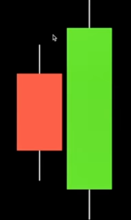

**设立条件**：
- 一定要**完全吞噬**（此区域可成为未来价格回测时的反弹区）
- 确认在低时框有**失衡（Imbalance）** + **结构转换（MSS）**

---

### 破坏块（Breaker Block）

**定义**：被反方向主导的订单块。

- **流动性猎杀** + **结构转换**之后才能确认
- 原本的订单块突破后反向操作（阻力变支撑，支撑变阻力）
- 逆主要趋势的 Order Block 最容易被破坏

**条件**：
1. 发生猎杀
2. 确认存在有效的 Order Block
3. 价格收盘突破 OB
4. 发生结构转换

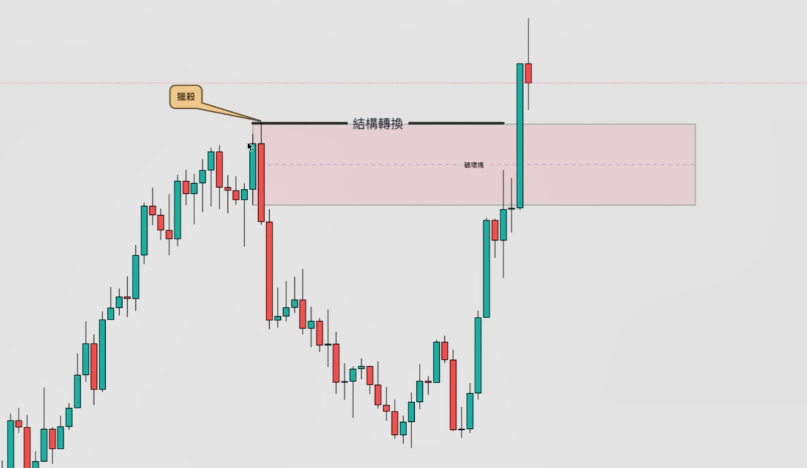

---

### 公平价差区（Fair Value Gap）

**定义**：价格在短时间内快速移动所留下的「价格空缺」。

**结构**：由 3 根 K 线组成
- 第一根：前 K
- 第二根：中间（大实体 K 线）
- 第三根：后 K

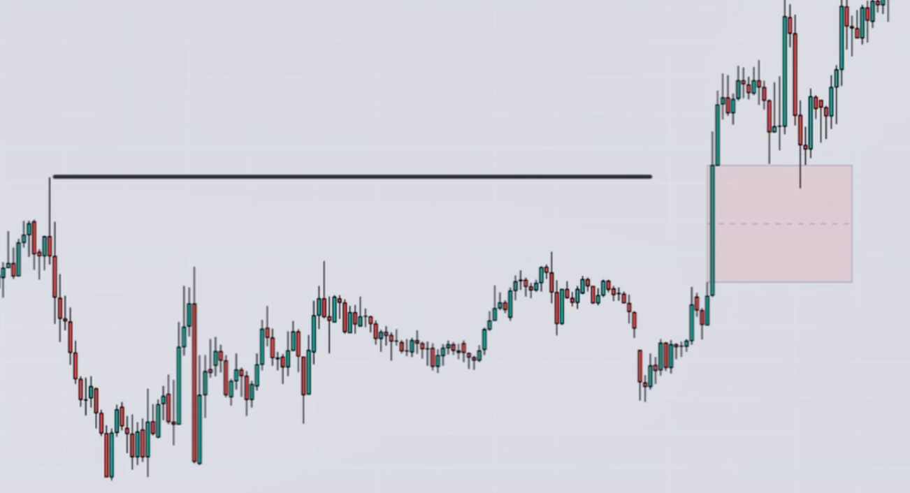
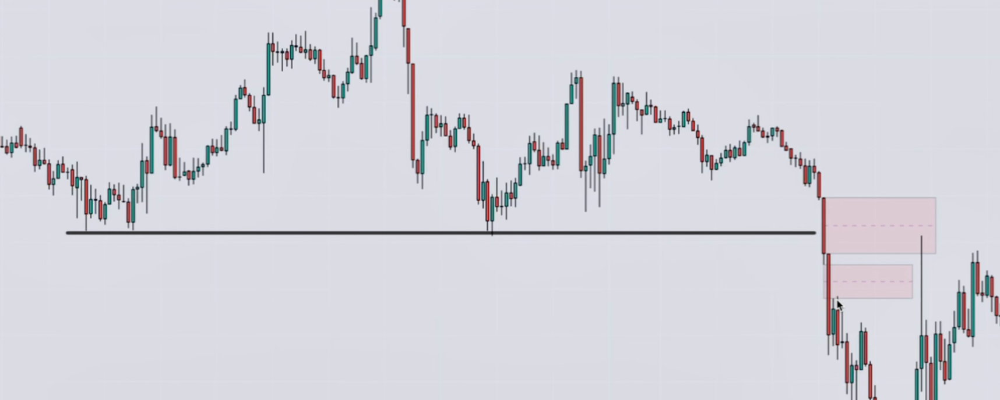

**其它 FVG 形态**：

| 形态 | 说明 |
|------|------|
| **逆向 FVG（Inverse FVG）** | 突破 FVG 区域 |
| **隐含 FVG（Implied FVG）** | 表面上没有明显空缺，但实体前后都有影线重叠 |

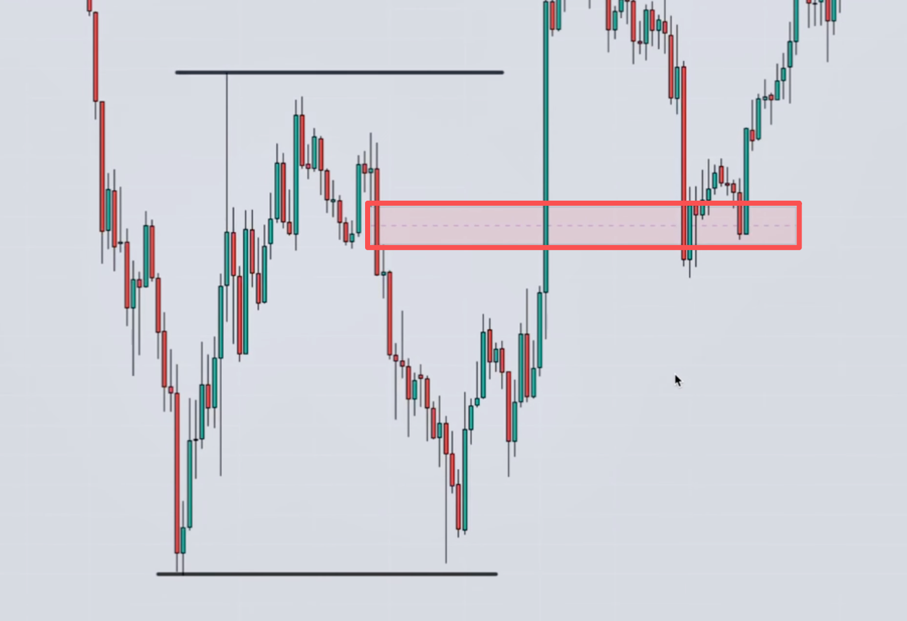
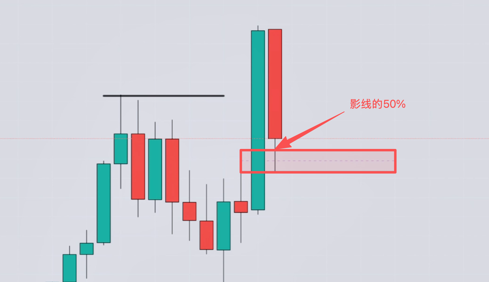

---

### 平衡价格区间（Balanced Price Range）

**定义**：两个相反方向的 FVG 重叠所形成的区域。

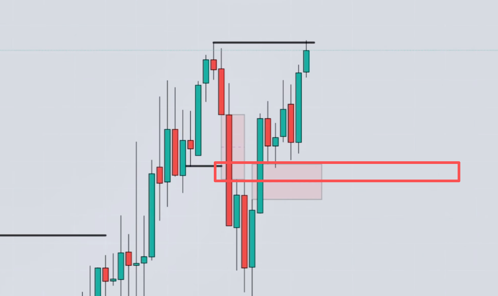

---

### 拒绝块（Rejection Block）

**定义**：长影线 + 流动性描述，反映市场对某个价格强烈的拒绝与反应。

**识别与用法**：
- 价格扫过前高/低位
- 出现长影线，该区域可标记为 Rejection Block
- 价格回测到拒绝块时，可考虑入场

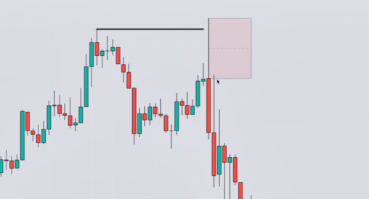

---

### 真空块（Vacuum Block）

**定义**：价格与价格之间的缺口。

- 价格未来可能会**先填补缺口**，再快速离开

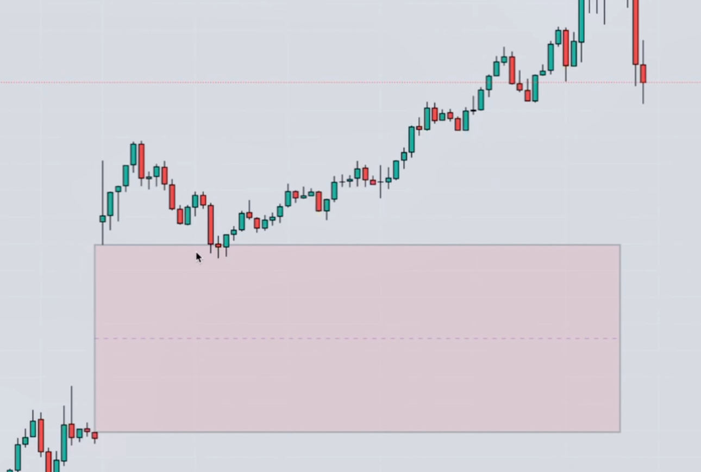

---

### 补仓块（Mitigation Block）

**定义**：趋势延续失败 + 结构转换所产生的区域。

**形成过程**：
1. 价格尝试突破新高/新低但未成功
2. 无法延续原本趋势，开始反转
3. 发生结构转换
4. 失败延伸段即为 Mitigation Block

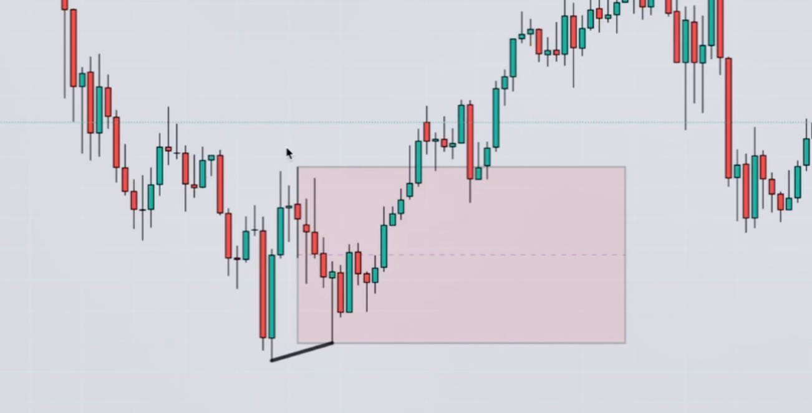
